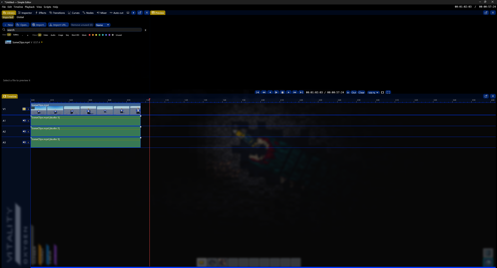

# Simple Editor



The fastest video editor on Windows. Free. One tiny exe, no install, no subscription, no BS.

Simple Editor is built to take on DaVinci Resolve, Premiere Pro, and CapCut, and win on speed,
simplicity, and community. It's for YouTubers, shorts creators, anime editors, filmmakers, and
anyone editing video for work or school. Everything the big paid apps give you, minus the bloat and
the price tag.

**[Download the latest release](https://github.com/KashTheKing/simple-editor/releases/latest)**
(about 10 MB) and **[join the Discord](https://discord.gg/6taNJVs5FT)**. This is a young project and
I want your feedback. Tell me what's broken, what's missing, what would make you switch for good.

> **Beta software.** Most features are still being tested and polished daily. It's great for
> everyday editing right now, but it's not ready for huge productions or anything mission critical
> yet. Keep backups. It's getting more stable every day.

## Features

On top of all the normal editing stuff (multi-track timeline, trim, cut, split, keyframes, speed
ramping, transitions, blend modes), Simple Editor also has:

- AI transcription, auto subtitles, and double-take detection
- Dead-air removal (auto-cut silence)
- Just one file, under 15 MB, opens almost instantly
- Built-in file converter
- YouTube, TikTok, X, and general URL video downloader/importer
- Luau scripting, plugins, tooling, and expressions
- OpenGL effects plus a custom GLSL shader editor
- Motion tracking, masking, shapes, and live drawing/annotating
- Full audio mixer: EQ, reverb, distortion, compressor, and more
- Node-graph editor for effects
- CapCut-style templates and containers
- Effect and transition presets
- 25+ built-in themes, plus your own custom theme, in cozy or sharp style
- Fully customizable editor layout
- Planning and to-do lists for your project
- Auto-keyframing and velocity tools for smooth animation
- Style-summary generator (auto-writes a style guide for your project)
- MCP server so AI assistants (like Claude) can help you edit
- Import/export project files with DaVinci Resolve and Premiere Pro
- And a lot more

## Requirements

- Windows 10 or 11 (64-bit). No installer needed.
- [FFmpeg](https://ffmpeg.org) for export, images, and fallback playback. Get it with
  `winget install Gyan.FFmpeg` or `choco install ffmpeg`, or point Settings at its folder. Basic
  playback works without it.

### Optional extras

These stay off until you install their tool. Nothing gets downloaded without you asking.

- **URL import** (YouTube/TikTok/X): install [yt-dlp](https://github.com/yt-dlp/yt-dlp)
  (`winget install yt-dlp.yt-dlp`). The Import URL button shows up once it's found.
- **AI transcription/subtitles**: install [whisper.cpp](https://github.com/ggml-org/whisper.cpp) and
  point Settings at it. The app downloads the model for you the first time you use it.
- **Hardware export** (NVENC/QSV/AMF): just needs the matching GPU driver, shows up automatically.

## Build from source

```
cargo build --release
```

Output: `target\release\simple-editor.exe`. Needs Rust 1.88+.

## Run it

Double-click the exe, or `simple-editor.exe video.mp4` to open a file straight away. Right-click any
video in Explorer for an "Edit with Simple Editor" option too.

Every shortcut is rebindable in Settings. The default layout is drag-and-drop customizable, pop any
panel into its own window, save your own layouts.

## Test

```
cargo test
```

See `CHANGELOG.md` for what's new and `ARCHITECTURE.md` for how it's built.
